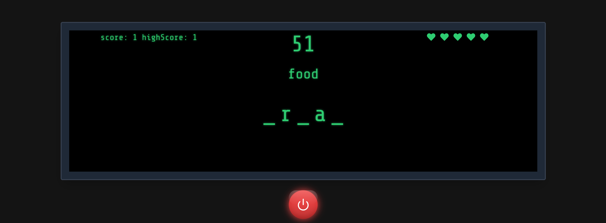

# Word Game 🎮

A word discovery game where players test their vocabulary and spelling.



## 🎯 Features

- score and highScore system
- random word generation
- lives system
- random letters shown for each word
- [More features coming soon!]

## 🚀 Quick Start

Make sure you have [Node.js](https://nodejs.org/) installed on your system.

1. Clone the repository:

```bash
git clone https://github.com/RoniGuru/word-game.git
```

2. install packages

```bash
npm install
```

2. run dev

```bash
npm run dev
```
